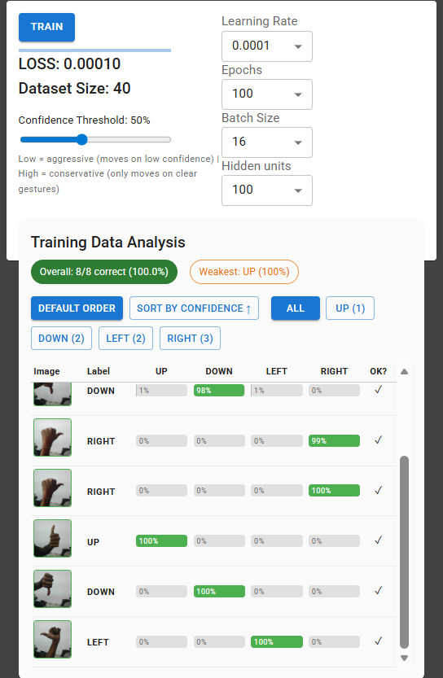
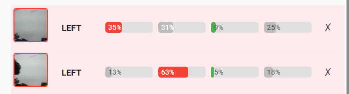
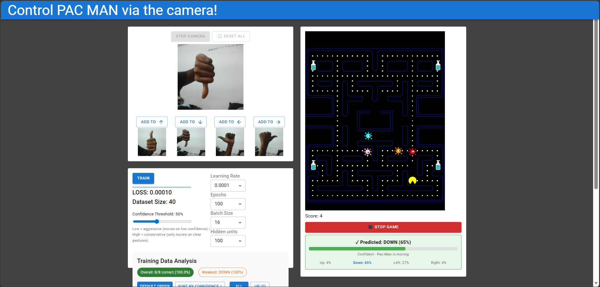
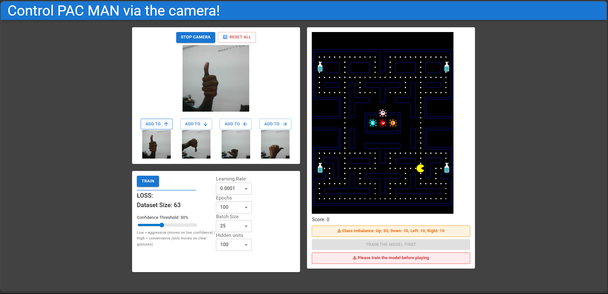
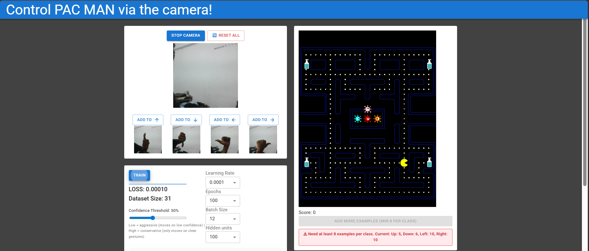

<h1 align="center"> ML-PANCMAN</h1>
<h3 align="center">Improving Human-AI Interaction Through Interactive Visualization</h3>

<p align="center">
  <em>A browser-based gesture recognition enhanced with few improvements with reference to <a href="https://www.microsoft.com/en-us/haxtoolkit/ai-guidelines/">Microsoft's 18 Guidelines for Human-AI Interaction</a></em>
</p>

<p align="center">
  
  
  
  
</p>

---

## About

ML-PANCMAN lets users train a machine learning model with webcam hand gestures to control Pac-Man entirely in the browser. The underlying model uses **MobileNet v1 (0.25, 224)** as a feature extractor with a small trainable dense head, demonstrating **transfer learning** with TensorFlow.js.

This fork implements **four interface improvements** designed to address specific Human-AI Interaction guideline violations identified through evaluation of the original demo.

> **Original project:** [Visual-Intelligence-UMN/ML-PANCMAN](https://github.com/Visual-Intelligence-UMN/ML-PANCMAN)

---
## Images

<p align="center">
  
  
  <br/>
  <em>Prediction Matrix - per-example confidence bars (green = correct, red = incorrect), sortable and filterable by class</em>
</p>

<br/>

<p align="center">
  
  <br/>
  <em>Live gameplay - real-time confidence breakdown, confidence gate status, and Stop Game control</em>
</p>

<br/>

<p align="center">
  
  <br/>
  <em>Main interface - gesture capture panel, training controls, Pac-Man game, and class imbalance warning</em>
</p>

<br/>

<p align="center">
  
  <br/>
  <em>Play Gate - game start is blocked until at least 8 examples per class are collected</em>
</p>


---
## The Problem

The original ML-PANCMAN demo has several critical human-AI interaction issues:

| Problem | Impact |
|---------|--------|
| Model **always picks a direction**, even on garbage input | Users trust the wrong predictions - no concept of "I don't know" |
| **Zero visibility** into model performance after training | Users can't tell if model learned well or poorly |
| **No guidance** on data quantity, quality, or class balance | Users guess how much data is "enough" |
| **No undo/reset** capability | Mistakes require full page reload |
| **No stop button** during gameplay | Must play until game over even after spotting problems |

These map to violations of **9 Microsoft HAI Guidelines**: G2, G4, G7, G8, G9, G10, G11, G16, G17.

---

## My Four Improvements

###  Improvement 1: Prediction Matrix View
`Guidelines: G2 · G11 · G16`

An interactive visualization that appears after training, showing every training example alongside the model's per-class confidence scores.

**Features:**
-  Green confidence bars = correct predictions
-  Red confidence bars = incorrect predictions  
-  Sort by confidence (ascending) to address problematic examples
-  Filter by class to diagnose per-class issues
-  Hover to enlarge thumbnails for inspection
-  Summary chips: overall accuracy + weakest class
-  **80/20 train-test split** - this way model evaluates efficiently  

> **Why it matters:** Users can SEE how blurry, ambiguous, or mislabeled training images lead to low confidence and wrong predictions. Reveals the relationship between data quality and model performance.

---

### Improvement 2: Confidence-Gated Controller
`Guidelines: G10 · G17`

An adjustable confidence threshold that controls when Pac-Man responds to predictions.

**Features:**
-  Slider to set confidence threshold (20% → 95%)
-  Below threshold: Pac-Man **pauses** instead of moving on uncertain predictions ( prevents model from guessing!! )
-  Green indicator = confident, Pac-Man moving
-  Orange indicator = uncertain, Pac-Man paused
-  Real-time per-class confidence breakdown (Up: X%, Down: X%, Left: X%, Right: X%)

> **Why it matters:** Softmax always produces a distribution summing to 1 - even on random noise. It cannot express "I don't know." The confidence gate adds this missing uncertainty behavior and gives users control over the confidence-accuracy tradeoff.

---

### Improvement 3: Play Gate + Class Imbalance Warning
`Guidelines: G7 · G2 · G4`

Prevents users from starting the game before the system is ready.

**Features:**
-  Start Game button **disabled** until: model is trained AND ≥8 examples per class
-  Clear messages: `"Train the model first"` or `"Add more examples (min 8 per class)"`
-  Class imbalance detection: warns when any class has 3x more examples than another
-  Visible warning banners (not just greyed-out text)

> **Why it matters:** The original lets you start with zero data is - confusing and broken. Minimum of 8 per class ensures the 80/20 split has enough for both training (~6/class) and evaluation (~2/class).

---

### Improvement 4: Reset All + Stop Game
`Guidelines: G9 · G8`

Essential controls missing from the original interface.

**Features:**
-  **Reset All**: clears training data + model + results without page reload (with confirmation)
-  **Stop Game**: mid-game exit button for faster iteration
-  Fresh game state on every restart ( the game doesn't resume from the previous game's progress instead it starts over i.e. it restarts the game )

> **Why it matters:** Without Reset, mistakes required full page reload. Without Stop, users played until game over even after spotting problems early.

---

## Architecture

```
┌──────────┐     ┌────────────┐     ┌──────────────────┐      ┌────────────────┐
│  Webcam  │ ──► │  Resize to │ ──► │  MobileNet v1    │ ──►  │  Dense Head    │
│  Frame   │     │  224×224   │     │  (frozen at      │      │  (trainable)   │
│          │     │  Normalize │     │  conv_pw_13_relu)│      │  Dense→ReLU    │
└──────────┘     └────────────┘     └──────────────────┘      │  Dense→Softmax │
                                                              └───────┬────────┘
                                                                      │
                                                              ┌───────▼────────┐
                                                              │  Confidence    │
                                                              │  Gate Check    │
                                                              │  (threshold)   │
                                                              └───────┬────────┘
                                                                      │
                                                    ┌─────────────────┼─────────────────┐
                                                    │                 │                 │
                                              ┌─────▼─────┐    ┌──────▼──────┐   ┌──────▼──────┐
                                              │  Pac-Man  │    │ Confidence  │   │ Prediction  │
                                              │  Movement │    │ Display     │   │ Matrix      │
                                              └───────────┘    └─────────────┘   └─────────────┘
```

**Few Things to Keep in Mind:**

| Decision | Reason |
|----------|-----------|
| Modified `predict()` to return full probability distribution | Both improvements need per-class confidences, not just argmax |
| Used React refs for threshold | Ensures slider updates in real time |
| 80/20 random train-test split | Better evaluation as training accuracy alone is misleading (overfitting) |
| 350ms prediction interval | Balanced tradeoff between control responsiveness and game performance |
| Minimum 8 examples per class | With 80/20 split, ensures ~6 training + ~2 test images per class |

---

##  HAI Guidelines Summary

| # | Guideline | Violated? | Severity | My Solution |
|---|-----------|-----------|----------|-------------|
| G1 | Make clear what system can do | Partial | Medium | — |
| G2 | Make clear how well it performs |  Yes | High | Prediction Matrix |
| G4 | Show contextually relevant info |  Yes | Medium | Confidence Display, Play Gate |
| G7 | Support efficient invocation |  Yes | Medium | Play Gate |
| G8 | Support efficient dismissal |  Yes | Medium | Stop Game |
| G9 | Support efficient correction |  Yes | High | Reset All |
| G10 | Scope services when in doubt |  Yes | **Critical** | Confidence Gate |
| G11 | Make clear why system did what it did |  Yes | High | Prediction Matrix |
| G15 | Encourage granular feedback |  Yes | Medium | — (future work) |
| G16 | Convey consequences of user actions |  Yes | High | Prediction Matrix |
| G17 | Provide global controls |  Yes | Medium | Threshold Slider |

---

##  Setup & Run

```bash
# Clone this repository
git clone https://github.com/Chinmayvk7/ML-PANCMAN.git

# Navigate to project directory
cd ML-PANCMAN

# Install dependencies
npm install

# Start the server
npm start
```

Opens at [http://localhost:3000](http://localhost:3000) · Google Chrome recommended

---

## Future Directions

| Idea | Guideline | Description |
|------|-----------|-------------|
| Grad-CAM Visualization | G11 | Highlight which image regions the model focuses on |
| Per-example Delete/Relabel | G9 | Remove or fix individual training examples |
| Data Augmentation Suggestions | G2 | Recommend when training set needs more diversity |
| Confidence Calibration | G10 | Temperature scaling for better-calibrated softmax probabilities |

---

## Built With

| Technology | Purpose |
|-----------|---------|
| [TensorFlow.js](https://www.tensorflow.org/js) | In-browser ML inference and training |
| [MobileNet v1](https://arxiv.org/abs/1704.04861) | Pre-trained feature extractor |
| [React](https://react.dev/) | UI framework |
| [Jotai](https://jotai.org/) | Global state management |
| [Material UI](https://mui.com/) | Component library |

---

<p align="center">
  <strong>Chinmay VK</strong><br>
  B.Tech CSE · NIT Rourkela<br>
  <a href="https://github.com/Chinmayvk7">GitHub</a>
</p>